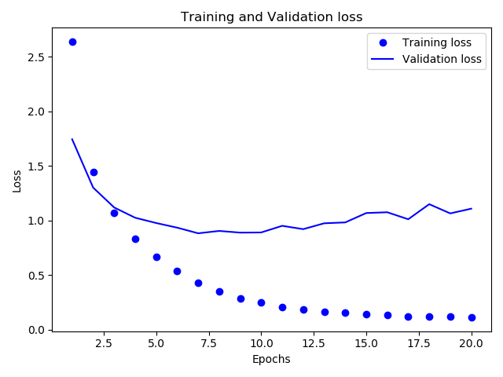
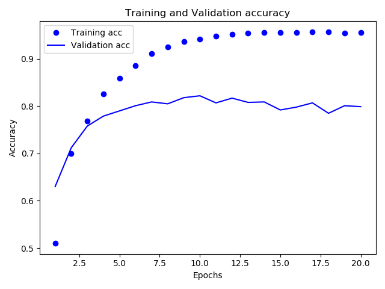

# 뉴스 기사 분류:다중 분류
지난 번에는 영화 리뷰 데이터IMDB를 2가지로 분류하는 이진 분류 문제를 풀어보았다.
이번에는 로이터 통신에서 제공하는 뉴스를 46 가지의 상호 베타적인 주제로 분류하는 신경망을 만들어보자.

이는 대표적인 다중 분류Multiclass Classification의 예이다.

이 예시는 각 데이터 포인트가 정확히 하나의 범주로 분류되기 이는 단일 레이블 다중 분류Single-label, Multiclass Classification 문제입니다.

각 데이터 포인트가 여러 개의 범주에 속할 수 있다면 이는 다중 레이블 다중 분류 문제가 된다.

## 로이터 데이터셋Reuter Dataset
1986년 로이터에서 공개한 짧은 뉴스 기사와 토픽의 집합인 로이터 데이터셋은 덱스트 분류를 위해 널리 사용되는 간단한 데이터셋입니다.

46개의 토픽이 있으며, 어떤 토픽은 다른 것에 비해 데이터가 많지만 각 토픽별로 훈련 세트에 최소 10개의 샘플 데이터를 갖고 있다.

로이터 데이터셋은 8982개의 학습 데이터와 2246개의 테스트 데이터로 구성되어 있다.

### 데이터 구조
뉴스 데이터는 어휘 사전을 활용한 정수 리스트로 되어 있으며, 라벨 데이터는 각 토픽을 의미하는 0~45 사이의 정수로 되어있다.

## 오버피팅 분석

대강 7~9 에포크 사이에 오버피팅이 발생한다.